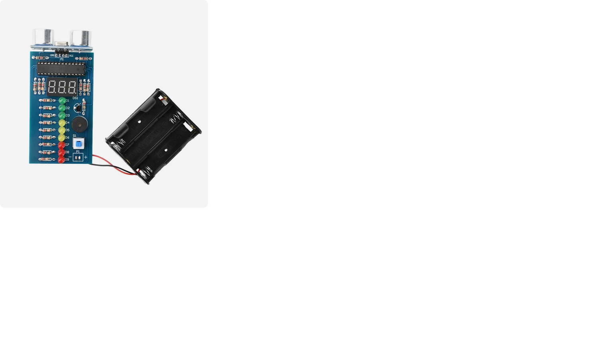

### Description

This is a custom firmware (written from scratch) for the Range Finder DIY kit.

The kit is built around HC-SR04 ultrasonic sensor and STC15 series MCU (Enhanced 8051) in
DIP-28 package. If you have a different kit then it will probably not work.

Original kit goes with STC15W408S MCU but the firmware does not make use of its extended
features. So it could be replaced by any other one having the same package/pinout and 2K
flash memory, at least. For example, I successfully tested it with STC15F204EA chip.

To rebuild firmware from source you would need free SDCC compiler. Few firmware options
could be changed by editing the file `src/config.h`. Make sure that PCB pinout and MCU
frequency match yours!

To download the firmware you would also need an USB-TTL converter, breadboard, some
jumper wires (RX/TX, 5V and GND only) and software (AIAPP-ISP or stcgal). Please, note
that many STC MCUs do not use RESET line by default, so you have to mount a power switch
instead.
